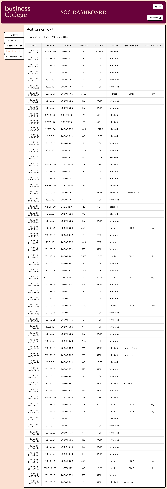

# SOC Dashboard

## Johdanto

SOC Dashboard on web-sovellus, joka tarjoaa käyttäjille interaktiivisen ja reaaliaikaisen hallintapaneelin tietoturvakomponenttien seurantaan ja hallintaan.

Tämä projekti on kehitetty osana koulutehtävää, jossa harjoitellaan nykyaikaisten web-teknologioiden käyttöä.

Projektin tavoitteena on tarjota käyttäjille selkeä ja tehokas tapa seurata tietoturvaan liittyviä tapahtumia ja komponentteja. Se pyrkii ratkaisemaan ongelman, jossa monimutkaisten tietoturvajärjestelmien hallinta on haastavaa ja vaatii intuitiivisen käyttöliittymän.

## Projektin tavoite

Projektin päämääränä on kehittää yksinkertainen, mutta tehokas hallintapaneeli tietoturvakomponenttien ja tapahtumien hallintaan. Sovellus on suunniteltu helpottamaan tietoturvatiimien työtä tarjoamalla visuaalisia ja reaaliaikaisia tietoja turvallisuusjärjestelmistä.

## Kohdeyleisö

Projekti on suunnattu tietoturva-alan ammattilaisille, kehittäjille ja oppijoille, jotka haluavat ymmärtää paremmin, miten hallita ja seurata tietoturvakomponentteja web-pohjaisella käyttöliittymällä.

## Käytetyt teknologiat

- **React**: Käytetään käyttöliittymän rakentamiseen.
- **Vite**: Moderni kehitystyökalu, joka nopeuttaa kehitysprosessia.
- **JavaScript**: Sovelluksen logiikka ja interaktiivisuus.
- **CSS**: Käyttöliittymän tyylit.
- **HTML**: Perusrakenne.

## Live-demo

[Soc dashboard](https://isratjahan13.github.io/official_soc_dashboard/)

## Kuvakaappaukset

## Lähteet

Tämä projekti sai inspiraatiota [cyberpitin sivuilta](https://www.cyberbit.com/soc-operations/soc-metrics-for-improved-soc-performance/), joka tarjosi perustan hallintapaneelin kehittämiselle. Kiitos alkuperäisille kehittäjille, joiden työstä tämä projekti on saanut vaikutteita. Teimme Style Guiden annettujen värien ja fonttien pohjalta, sekä haimme vaikutteita ja tyylejä [Helsinki Business Collegen](https://opiskelija.bc.fi/) verkkosivuilta.

## Tekijät

- **Israt**: Projektin aikataulutus ja Trellon ylläpito. Käyttöliittymän suunnittelu ja sovelluksen logiikan toteutus. Haittaohjelmat-komponentin ja reitittimen tietojen siirrot-komponentin luominen.
- **Saima**: Käyttöliittymän suunnittelu ja sovelluksen logiikan toteutus. CSS-tyylittely ja responsiivisen suunnittelun optimointi. Työaseman verkkoliikenteen käyttäytymis-komponentin luominen. Eri teemojen lokien tekeminen. Dark mode-elementin tekeminen.
- **Madhusmitamis**: Tietoturvaominaisuuksien määrittely ja käyttöliittymän linkkien integraatio. Sisäänkirjautumiset-komponentin ja tunnistautumis- ja varmennustapahtumat-komponentin luominen.
